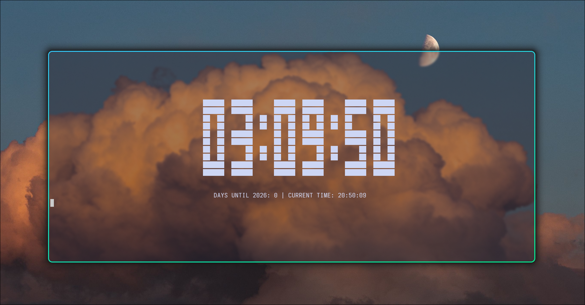

 

---

**New Year counter - it counts the time on your computer along with the date and tells you how much time it is until New Year's**

---

* Language: Golang

* Rendering: ANSI and ASCII Art escape codes

* Scaling: Dynamic matrix grid calculation (digital)

### Requirements
* [Go](https://go.dev/doc/install) installed (version 1.20 or higher).

# Install
